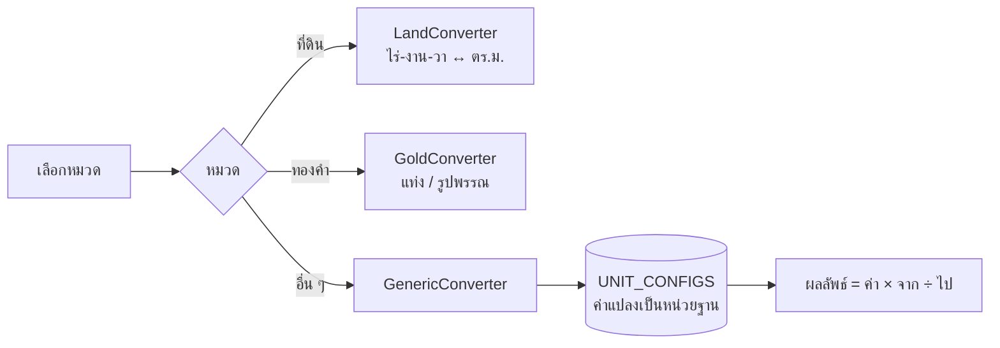

# 🇹🇭 KANAO Thai Converter

[](https://github.com/adisorn6302565/KANAO-Thai-Converter/actions/workflows/pages.yml)


เครื่องมือแปลงหน่วยวัดแบบไทย เช่น ไร่-งาน-วา, บาททองคำ-สลึง, เกวียน-ถัง, วา-ศอก-คืบ, หาบ-ชั่ง-ตำลึง, ทะนาน ใช้ง่ายบนมือถือ คำนวณในเบราว์เซอร์ทั้งหมด

## 🌐 ใช้งานออนไลน์

**https://adisorn6302565.github.io/KANAO-Thai-Converter/**

## ✨ ฟีเจอร์

| หมวด | หน่วย |
|---|---|
| ที่ดิน | ไร่ งาน ตารางวา ตร.ม. เอเคอร์ เฮกตาร์ |
| ทองคำ | บาท สลึง กรัม ทรอยออนซ์ (ทองแท่ง 15.244 g / ทองรูปพรรณ 15.16 g) |
| เกษตร | เกวียน ถัง กิโลกรัม |
| ความยาว | วา ศอก คืบ เส้น โยชน์ เมตร |
| น้ำหนัก | หาบ ชั่ง ตำลึง กิโลกรัม |
| ปริมาตร | ทะนาน ลิตร |

- ค้นหาหมวด, ปักหมวดที่ใช้บ่อย, จำหมวดล่าสุด (`localStorage`)
- สลับหน่วยต้นทาง/ปลายทาง, คัดลอกผลลัพธ์
- ไม่มี backend ไม่ส่งค่าที่กรอกออกไปไหน

## 🧩 การทำงาน



## 💻 รันในเครื่อง

ต้องมี [Node.js 20+](https://nodejs.org/)

```bash
npm install
npm run dev      # http://localhost:3000
npm run build    # ไฟล์ static ใน dist/
```

**Deploy:** push เข้า `main` → GitHub Actions build แล้วขึ้น GitHub Pages อัตโนมัติ

```text
├── App.tsx
├── components/   # LandConverter, GoldConverter, GenericConverter, Card, icons
├── constants.tsx # ค่าแปลงหน่วยทั้งหมด
├── types.ts
└── index.css     # Tailwind
```

## 🆕 v1.1

- build ไม่ผ่านจาก type error (`JSX` namespace ของ React 19, `units` เป็น `unknown`) แก้แล้ว
- เลิกใช้ Tailwind / React จาก CDN ตอนรัน เปลี่ยนเป็น build ปกติ (โหลดเร็วขึ้น ใช้ offline ได้)
- Deploy GitHub Pages อัตโนมัติ
